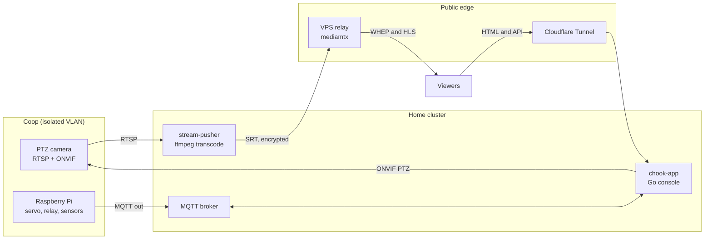

#  Chicken Feed

## 🐔 Interactive Chicken Coop Livestream

[](https://chook.cam)
[-b3e6b3?style=for-the-badge&logo=github&logoColor=black)](https://github.com/lmacka/coopi)

[](https://github.com/lmacka/chickenfeed/actions/workflows/ci.yml)


Watch my backyard chickens at **[chook.cam](https://chook.cam)**, drive the camera, and dispense
treats. Sub-second video, and a control queue so everyone gets a turn.

> A real deployment, not a demo. The design notes below are the ones that actually mattered.

---

## How it fits together



**Nothing on the internet reaches into the coop.** Every connection crossing the home boundary is
opened from the inside: the cluster *pushes* video out, and the Pi *dials out* to the broker. An
earlier version had the public VPS reach inward over a VPN subnet route, and when that route
stopped being advertised the site went dark for months without anyone noticing.

## Layout

| Path | What it is | Runs on |
|---|---|---|
| `v2/app/` | `chook-app`: the public console. Go, serves the page and control API | Kubernetes, in-cluster |
| `v2/vps/` | Video relay: mediamtx + swag. Receives SRT, fans out WebRTC/HLS | Small public VPS |
| `v2/chicky/` | Coop controller: treat servo, light relay, climate sensors | Raspberry Pi, balena |

Kubernetes manifests live in a separate private GitOps repo, not here.

## Design notes worth stealing

**The queue is the security model.** One visitor holds the console at a time for a 30-second turn,
and every actuating request must carry that holder's token. Abuse requires holding the seat, which
is limited to one person, so there is no per-endpoint rate limiter. Turnstile guards entry to the
queue once per visitor rather than on every button press.

**Safety lives on the device, not the website.** `chicky` decides whether a treat is actually
dispensed: daylight window from a real sunrise/sunset calculation, cooldown, daily quota persisted
across restarts, and a light auto-off timer. The web app can only *ask*. A bug in, or a full
compromise of, the public site cannot overfeed the chickens or leave the light on all night.

**Browsers only decode Constrained Baseline H.264 over WebRTC.** The camera emits High profile.
mediamtx does not transcode, so it negotiates `profile-level-id=42e01f` and then forwards a High
profile bitstream: signalling succeeds completely and the browser renders nothing. `curl` and
`ffprobe` both handle High profile fine, so no command-line check catches it. The pusher now
transcodes to Constrained Baseline, which as a side effect also fixed an HLS muxer crash caused by
the camera's clock jumping backwards.

**WebRTC cannot carry AAC.** A WHEP viewer attaching to a stream carrying an AAC track made
mediamtx panic and exit: a remote crash of the public origin, triggered by one viewer connecting.
The stream is published video-only.

**If it breaks, it should say so.** The previous version published no metrics, which is why an
outage lasted months. Stream liveness, queue depth and command latency are scraped now, with an
alert on the publisher going absent.

## Running it

Every component is configured by environment variables; there are no secrets in this repository.
See `v2/app/main.go`, `v2/chicky/main.py` and `v2/vps/mediamtx.yml.example`.

```bash
# console. MQTT is required: with no broker reachable it exits rather than
# pretending the coop is there.
cd v2/app && go run .           # :8080

# coop controller. Falls back to mock hardware when no GPIO is present,
# so this runs anywhere.
cd v2/chicky && python main.py  # :3000

# safety envelope tests
cd v2/chicky && python test_runner.py
```

## Security

Secrets are never committed. Runtime config is injected by the platform: Kubernetes Secrets for the
console, balena device variables for the Pi, and a gitignored `.env` for the relay. To report an
issue, see [SECURITY.md](SECURITY.md).

## Licence

GPL-3.0. Be kind to your chickens.
