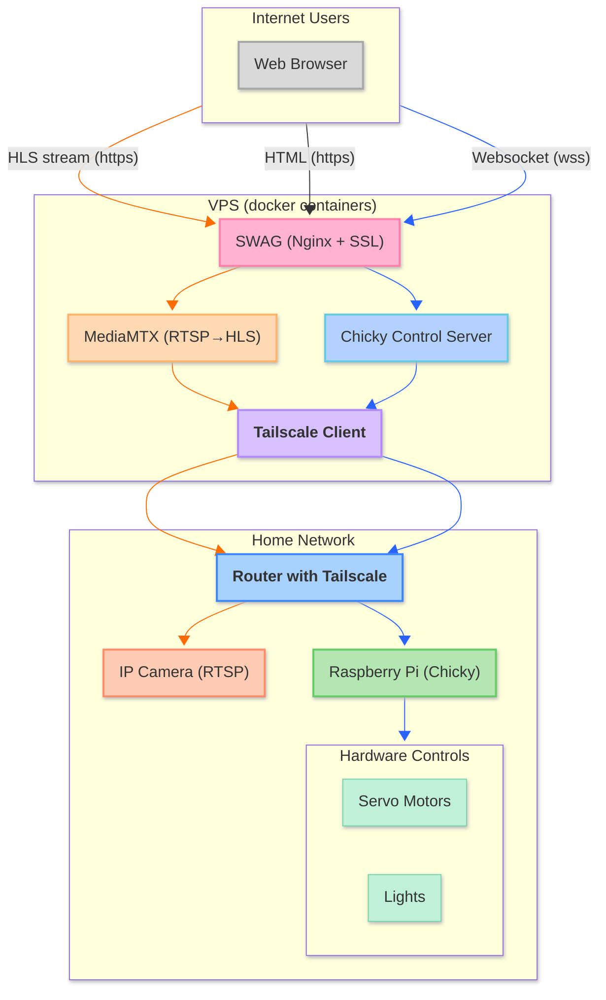

#   Chicken Feed

## A Smart Chicken Coop Monitoring System
Interactive chicken video stream; who woulda thunk it?

## 📋 What's This?

This is my little project that lets me keep an eye on my chickens from anywhere. It streams video from my backyard to the web and even lets visitors interact with the setup remotely. Pretty neat, right?

Under the hood, it's got some cool tech that I've put together to solve a bunch of interesting problems:

- Streaming video from a home network without killing my bandwidth
- Connecting home hardware to the internet (safely!)
- Controlling physical stuff remotely
- Making it all work together seamlessly

## 🏗️ How It Works

## 🧩 The Pieces

### At Home
- A **Raspberry Pi** running Node.js to control everything
- An **IP Camera** (TP-Link Tapo C220) that can pan and tilt
- Some **servo motors** hooked up to a feed dispenser
- **Tailscale** running on the router for secure networking

### In The Cloud
- A VPS running **Docker** containers for all the services
- **MediaMTX** to handle the video streaming magic
- **SWAG** (Nginx with SSL) to serve up the web interface
- A **Node.js server** that handles all the control commands
- **Tailscale** to create a secure tunnel back to my home network

## 💡 Cool Technical Bits

- The whole setup uses just **one connection** from my home network, no matter how many people are watching
- **HLS streaming** means it works in any modern browser without plugins
- **Tailscale** creates an encrypted network between my home and the cloud server
- Everything runs in **Docker containers** for easy deployment and updates
- The **camera controls** work in real-time with minimal lag

## 🔒 Keeping Things Secure

```mermaid
---
config:
  layout: dagre
  look: neo
---
flowchart LR
    User["Internet User"]
    SSL["SSL Termination"]
    Auth["Auth Layer"]
    Tailscale["Tailscale Network"]
    Home["Home Network"]
    
    User -->|HTTPS| SSL
    SSL -->|HTTP| Auth
    Auth -->|If Authorized| Tailscale
    Tailscale -->|Encrypted| Home
    
    User:::viewerNode
    SSL:::swagNode
    Auth:::controlNode
    Tailscale:::tailscaleNode
    Home:::routerNode
    
    classDef routerNode fill:#a8d1ff,stroke:#3a87ff,stroke-width:2px,color:#333,font-weight:bold
    classDef tailscaleNode fill:#d8c1ff,stroke:#b38aff,stroke-width:2px,color:#333,font-weight:bold
    classDef swagNode fill:#ffb3d1,stroke:#ff80ab,stroke-width:2px,color:#333
    classDef controlNode fill:#b3e6f2,stroke:#66ccdf,stroke-width:2px,color:#333
    classDef viewerNode fill:#d9d9d9,stroke:#a6a6a6,stroke-width:2px,color:#333
    
    linkStyle 0 stroke:#FF6D00,fill:none
    linkStyle 1 stroke:#FF6D00,fill:none
    linkStyle 2 stroke:#2962FF,fill:none
    linkStyle 3 stroke:#2962FF,fill:none
```

I've set things up so that:
- All traffic is encrypted (HTTPS and Tailscale)
- My home devices aren't directly exposed to the internet
- You need special tokens to control anything
- Each component only has the permissions it absolutely needs

## 🚀 Why This Works Well

- Handles lots of viewers without breaking my home internet
- Converts camera video to a format that works well on the web
- Creates a secure tunnel between my home and the cloud
- Lets people interact with my chicken setup (which is just fun)
- Works on pretty much any device with a modern browser

## 📝 Todo List

- [ ] Add time restrictions around control interactions so the chooks get a good night's sleep
- [ ] Implement rate limiting on the API side of things
- [ ] Improve cooldown handling for controls
- [ ] Fix current viewer stats (currently broken)
- [ ] Redesign control panel for better user experience
