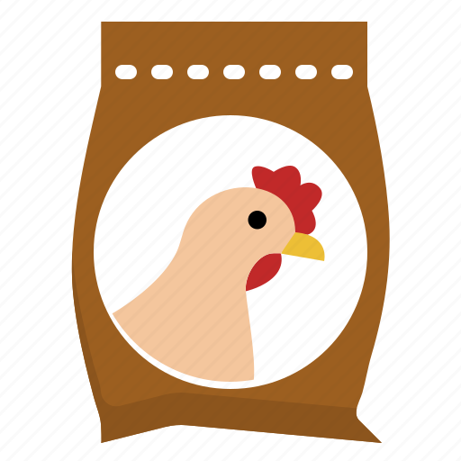
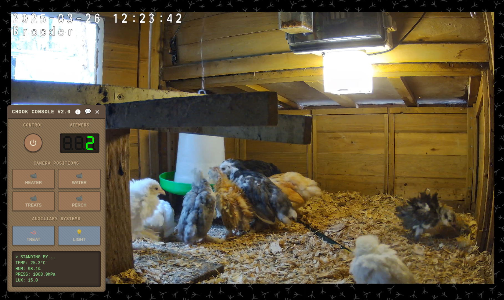
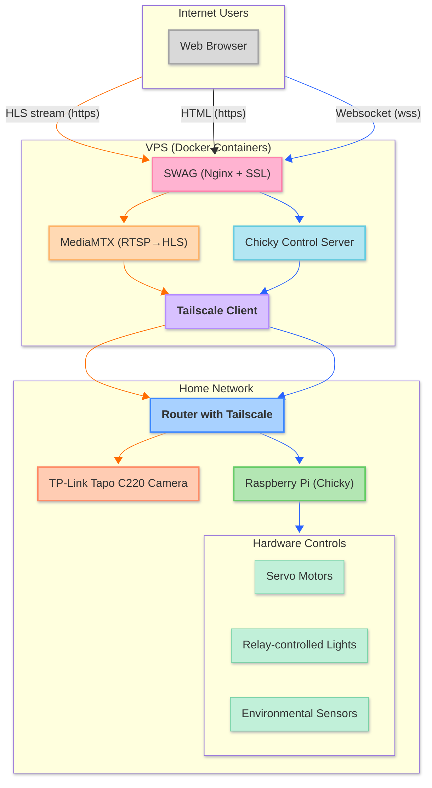

```mermaid
---
config:
  layout: dagre
  look: neo
---
flowchart LR
    User["Internet User"]
    SSL["SSL Termination"]
    Auth["Auth Layer"]
    Tailscale["Tailscale Network"]
    Home["Home Network"]
    
    User -->|HTTPS| SSL
    SSL -->|HTTP| Auth
    Auth -->|If Authorized| Tailscale
    Tailscale -->|Encrypted| Home
    
    User:::viewerNode
    SSL:::swagNode
    Auth:::controlNode
    Tailscale:::tailscaleNode
    Home:::routerNode
    
    classDef routerNode fill:#a8d1ff,stroke:#3a87ff,stroke-width:2px,color:#333,font-weight:bold
    classDef tailscaleNode fill:#d8c1ff,stroke:#b38aff,stroke-width:2px,color:#333,font-weight:bold
    classDef swagNode fill:#ffb3d1,stroke:#ff80ab,stroke-width:2px,color:#333
    classDef controlNode fill:#b3e6f2,stroke:#66ccdf,stroke-width:2px,color:#333
    classDef viewerNode fill:#d9d9d9,stroke:#a6a6a6,stroke-width:2px,color:#333
    
    linkStyle 0 stroke:#FF6D00,fill:none
    linkStyle 1 stroke:#FF6D00,fill:none
    linkStyle 2 stroke:#2962FF,fill:none
    linkStyle 3 stroke:#2962FF,fill:none
```

#  Chicken Feed

## 🐔 Interactive Chicken Coop Livestream

## 🐥 What is Chicken Feed?

**Watch and interact with my backyard chickens from anywhere in the world!**

Chicken Feed is an interactive livestream that lets you not only watch my chicken coop in real-time but also:

- 📹 Control the camera to look at different areas of the coop
- 🪱 Dispense treats to the chickens with the push of a button
- 💡 Turn the coop lights on and off
- 🌡️ View real-time environmental data like temperature and humidity
- 💬 Chat with other chicken enthusiasts

All from the comfort of your web browser, with no downloads required!

## 🎮 How to Use It

1. Visit [chook.cam](https://chook.cam) on any modern browser
2. Watch the live chicken stream
3. Click the power button to request control (if available)
4. Once you have control, use the buttons to:
   - Move the camera to different preset positions
   - Dispense treats to the chickens
   - Toggle the coop lights on/off
5. Chat with other viewers in the chat panel

Each visitor gets 30 seconds of control before it's passed to the next person in line. Commands have cooldown periods to prevent overuse and keep the chickens happy!

> 🕒 **Note:** Treat dispensing is only available during daylight hours to respect the chickens' sleep schedule.

## 🏗️ System Overview

## 🧩 System Components

### 💻 Cloud Server (VPS)

- **Web Interface**: Retro-styled control panel with live chat
- **Control Server**: FastAPI + Socket.IO backend for real-time control
- **Video Streaming**: MediaMTX for converting RTSP to web-friendly HLS
- **Web Server**: SWAG (Nginx with SSL) for secure web hosting
- **Network Security**: Tailscale VPN client for secure tunneling

### 🏠 Home Setup

- **Brain**: Raspberry Pi running custom Python controllers
- **Eyes**: TP-Link Tapo C220 PTZ IP camera
- **Treats**: Servo-controlled treat dispenser
- **Lighting**: Relay-controlled coop lights
- **Sensing**: Temperature, humidity, pressure, and light sensors
- **Networking**: Tailscale VPN for secure connectivity

## 🔧 Technical Deep Dive

### 🚀 Solving the Streaming Challenge

One of the biggest challenges was figuring out how to stream video from my home network to potentially many viewers without:

1. Exposing my home network directly to the internet
2. Overwhelming my home internet connection's upload bandwidth
3. Requiring viewers to install special software

**Solution: Single-connection proxied HLS streaming**

- The camera streams RTSP video to the local Raspberry Pi
- A single secure connection carries this stream to the cloud VPS via Tailscale
- MediaMTX on the VPS converts the RTSP stream to web-friendly HLS format
- Each viewer connects to the VPS, not my home network
- Result: Unlimited viewers with only one connection to my home!

### 🔒 Security Architecture

Security was a primary concern when building this system:

- **End-to-end encryption** using HTTPS and Tailscale WireGuard
- **No port forwarding** needed on the home network
- **Authentication tokens** for secure device-to-device communication
- **Control system** with timeouts and authorization checks
- **Rate limiting** to prevent abuse
- **Profanity filtering** in the chat system

### 🤖 Control Flow Architecture

When you click a button on the web interface, here's what happens:

1. Your browser sends a WebSocket message to the control server
2. The server validates your control permissions
3. If authorized, it forwards your command through the Tailscale tunnel
4. The Raspberry Pi receives the command and activates the appropriate hardware
5. A confirmation message is sent back through the same route
6. Your browser updates to show the command was executed

All of this happens in milliseconds, giving near real-time control!

### 📊 Sensor Data Collection

The system collects and displays real-time environmental data:

- **Temperature**: BME280 sensor (°C)
- **Humidity**: BME280 sensor (%)
- **Pressure**: BME280 sensor (hPa)
- **Light level**: BH1750 sensor (lx)

This data helps monitor coop conditions and provides interesting information for viewers.

### 🎨 UI Implementation

The web interface features:

- **Retro-terminal aesthetic** with green text on dark background
- **Seven-segment display** for the viewer count
- **Draggable control panels** for customizable layout
- **Visual cooldown indicators** on buttons
- **Control timer** with circular progress indicator
- **Mobile-responsive design** that works on any device

### 🐳 Deployment Architecture

The entire system is containerized using Docker for easy deployment and updates:

- **SWAG container**: Web server with automatic SSL certificate renewal
- **MediaMTX container**: Video streaming server
- **Chicky-control container**: FastAPI control server
- **Tailscale container**: Secure networking
- **Raspberry Pi container**: Hardware control system

## 🚧 Future Improvements

- [ ] Implement more advanced rate limiting on API endpoints
- [ ] Improve control & cooldown handling for smoother user experience
- [ ] Utilize a Coral TPU to learn to identify each chicken and name them
- [ ] Further lock down the tailscale network
- [ ] Improve chat security

## 🔍 Technologies Used

- **Backend**: FastAPI, Socket.IO, Python
- **Frontend**: HTML5, CSS3, JavaScript, Video.js
- **Hardware**: Raspberry Pi, GPIO, BME280, BH1750, Servos
- **Networking**: Tailscale, RTSP, HLS
- **Infrastructure**: Docker, SWAG (Nginx + Let's Encrypt), MediaMTX

## 💭 Why This Project?

I built Chicken Feed to solve a unique problem (monitoring my chickens) while exploring the intersection of:

- Internet of Things (IoT) hardware
- Real-time web technologies
- Secure remote access
- Video streaming optimization
- Interactive user experiences

The result is a fun project that demonstrates practical skills in full-stack development, hardware integration, and secure distributed systems.

---

*Chicken Feed is open source and available for educational purposes. Feel free to use ideas from this project, but please be kind to your chickens if implementing something similar!*
